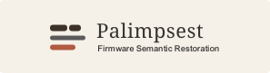

<p align="center">
  
</p>

<p align="center">
  A semantic code enhancement framework from Ghidra decompilation to CodeQL database construction
</p>

---

<details open>
<summary><b>English</b></summary>

## Project Overview

Palimpsest is an LLM-assisted semantic code enhancement framework that bridges Ghidra decompilation and CodeQL database construction. It is optimized for IoT device firmware analysis and for generating CodeQL-buildable source code.

The project focuses on semantic enhancement of decompiled code from IoT device firmware, making it suitable for subsequent CodeQL-based firmware vulnerability tracing, semantic querying, and software composition analysis.

## Principles and Architecture

Palimpsest adopts a multi-layer LLM-assisted semantic enhancement pipeline. It progressively enhances pseudocode generated by Ghidra and automatically builds a CodeQL database from the enhanced code.

The overall enhancement workflow is as follows:

```text
Ghidra MCP Service
    │
    │  Extract decompiled pseudocode from firmware functions
    ▼
LLM-Structure
    │
    │  Recover code structure, control flow, and function logic
    ▼
LLM-Naming
    │
    │  Recover names of variables, functions, and key semantic objects
    ▼
LLM-Agent review
    │
    │  Check semantic consistency and improve naming and code expression
    ▼
CodeQL Database (automatic no-build database creation)
```

The responsibilities of each stage are as follows:

| Stage | Input | Output | Purpose |
| --- | --- | --- | --- |
| `Ghidra MCP` | Firmware binary or decompilation results | Function-level pseudocode | Extract decompiled code for subsequent processing |
| `LLM-Structure` | Raw pseudocode | Structure-enhanced code | Recover control flow, function boundaries, and code organization |
| `LLM-Naming` | Structure-enhanced code | Naming-enhanced code | Improve the naming of variables, functions, and key semantic objects |
| `LLM-Agent` | Structure- and naming-enhanced code | Final enhanced code | Cross-function consistency review; fix naming, types, and call-site alignment |
| `CodeQL` | Collection of semantically enhanced code | CodeQL database | Support vulnerability tracing, semantic queries, and software composition analysis |

## Installation

```bash
git clone https://github.com/JINGQINLIN/Palimpsest.git
cd Palimpsest
```

Install dependencies:

```bash
pip install -r requirements.txt
```

## Usage

Run the project:

```bash
python main.py <firmware_path>
```

Example:

```bash
python main.py .\samples\udhcpd_dir895.bin
```

## Example Output

```text
(semant) semant_func > python .\main.py .\samples\udhcpd_dir895.bin

1. Raw package
  binary       samples\udhcpd_dir895.bin
  raw          output\udhcpd_dir895.bin\raw

Ghidra fetch
  binary       samples\udhcpd_dir895.bin
  output       output\udhcpd_dir895.bin\raw
  program      udhcpd_dir895.bin-41da71
  status       waiting for analysis
  functions    83
  0x0000f34c  FUN_0000f34c ━━━━━━━━━━━━━━━━━━━━━━━━ 83/83 0:00:03

Ghidra fetch done
  functions    83 ok, 0 failed
  output       output\udhcpd_dir895.bin\raw

2. Semantic reconstruction
  functions    78
  model        glm-5.1
  output       output\udhcpd_dir895.bin

  0x0000f550  FUN_0000f550 ━━━━━━━━━━━━━━━━━━━━━━━━ 78/78 0:31:27

3. CodeQL source
  structs      12
  files        78 C files
  output       output\udhcpd_dir895.bin\codeql\src
  symbols      143
  unresolved   17

4. Agent review
  functions    78
  model        glm-5.1
  changes      105 (rename 8, edit 90, rewrite 5, struct 2)
  functions edited 38
  tool calls   263
  tokens       in 244.1K | out 21.4K | cache 11.43M | total 11.70M
  log          output\udhcpd_dir895.bin\reconstruction\agent_review.json
  note         stopped at tool_use; review may be incomplete (raise _MAX_ITERATIONS)

5. CodeQL database
  command      codeql
  source       output\udhcpd_dir895.bin\codeql\src
  db           output\udhcpd_dir895.bin\codeql\db
  status       created output\udhcpd_dir895.bin\codeql\db

Done
  raw funcs    83
  skipped      5
  functions    78 ok, 0 failed
  tokens       in 441.5K | out 142.5K | cache 11.46M | total 12.04M
  recon        output\udhcpd_dir895.bin\reconstruction\functions
  registry     output\udhcpd_dir895.bin\reconstruction\registry
  codeql src   output\udhcpd_dir895.bin\codeql\src
  codeql db    output\udhcpd_dir895.bin\codeql\db
```

Each run re-fetches data from Ghidra and rebuilds the output package for the firmware.

Optional post-processing script:

```shell
python scripts/postprocess.py output/udhcpd_dir895.bin
# Or run one step only:
python scripts/postprocess.py output/udhcpd_dir895.bin --summarize-only
python scripts/postprocess.py output/udhcpd_dir895.bin --report-only
```

This writes per-function `summary.json` files and generates `reports/firmware_report.md`.

Validate CodeQL queries:

```powershell
$codeql = "path to codeql.exe"
$packs  = "path to codeql-queries"
& $codeql query run --quiet --search-path $packs queries\exec_calls.ql --database output\udhcpd_dir895.bin\codeql\db
```

Here, `queries/exec_calls.ql` is a simple example query for locating `system()` / `popen()` / `exec*()` calls and common firmware wrapper functions for command execution.

## Output Structure

```text
output/<binary>/
  raw/<addr>.json                          Raw Ghidra-decompiled pseudocode for each function
  reconstruction/
    functions/0x<addr>/
      raw.c structured.c named.c naming_map.txt
    registry/
      symbol_registry.{sqlite3,json,txt}   Cross-function symbol naming table
      struct_registry.sqlite3              Cross-function structure layout table
      unresolved_symbols.txt               Placeholders still unresolved after the first two recovery layers
    agent_review.json                      Change records and summary from Agent review
  codeql/
    src/
      recopilot_stubs.h                    Header file for Ghidra pseudo-types, macros, and common API declarations
      recopilot_types.h                    Structure header automatically generated from the structure registry
      0x<addr>_<name>.c                    Final enhanced source code used for database construction
    db/                                    CodeQL database
  reports/firmware_report.md               Firmware analysis report from scripts/postprocess.py, optional
```

## Code Structure

```text
main.py                       Entry point; orchestrates the five pipeline steps
config.py                     Loads local_config.yaml
pipeline/
  addresses.py                FUN_ symbol / address helpers
  artifacts.py                Shared reconstruction data types (avoids circular imports)
  c_source.py                 C source diff and error helpers
  console.py                  Rich console output
  paths.py                    Output path constants and resolution
  llm.py                      LLM client and token accounting
  outputs.py                  Disk output utilities
  prompts/
    manager.py                Jinja2 environment and template loader
    context.py                Loads RAG domain-prior YAMLs (contexts/*.yaml)
    structure.jinja2          Structure-recovery prompt
    naming.jinja2             Naming prompt
    summary.jinja2            Per-function summary prompt
    structure_coherence_repair.jinja2  Coherence-repair prompt for struct recovery
  registry/
    store.py                  Shared SQLite base for both registries (DDL + conflict log)
    naming.py                 NamingRegistry: cross-function symbol naming table
    structs.py                StructRegistry: cross-function structure layout table
    header.py                 Deterministically generates recopilot_types.h
    coherence.py              Struct field coherence gate (typed access validation)
  stages/
    order.py                  Topological ordering of functions for reconstruction
    ghidra.py                 Step 1: Ghidra fetch / raw package loading
    reconstruct/              Step 2: two-phase structure recovery + naming
      orchestrate.py            Topo-order driver with intra-layer parallelism
      _llm.py                   LLM call wrappers
      _parsing.py               Response parsing
      _apply.py                 Registry / source application
      evidence.py               Deterministic evidence bundles for offset-based structs
    summary.py / report.py    Optional post-processing for function summaries and firmware reports
  codeql/
    stubs.py                  Emits the static content of recopilot_stubs.h
    export_names.py           Filename normalization for CodeQL src files
    builder.py                Step 3: source export; Step 5: database construction
  agent/
    runner.py                 Step 4: tool-runner review loop
    catalog.py                Function metadata index (signature, indirect calls, …)
    session.py                Review session state
    context.py                System prompt assembly
    graph.py                  Static call graph from source
    syntax_utils.py           Clang-based syntax validation helpers
    tools/                    Agent tools split by review phase
      _dispatch.py _edit.py _explore.py _naming.py _prescan.py _shared.py _syntax.py _types.py
    playbook.md               Review methodology and constraints
    playbook_prescan.md       Pre-scan pass playbook
    playbook_syntax.md        Syntax-check pass playbook
    playbook_types.md         Type-coherence pass playbook
    playbook_naming.md        Naming pass playbook
    playbook_dispatch.md      Dispatch / routing playbook
    codeql_guide.md           CodeQL-friendly code rules
scripts/
  postprocess.py              Post-processing entry (summarize + firmware report)
  test_single_func.py         Single-function regression harness
queries/                      Example CodeQL queries (exec_calls, net_to_exec, packet_to_exec, taint_auth_check, test_flow)
contexts/                     RAG domain priors, such as dhcp_server.yaml, injected into prompts
samples/                      Example firmware samples
test_access_evidence.py       Regression test: struct access evidence
test_struct_registry.py       Regression test: StructRegistry
```

## License

This project is open-sourced under the MIT License.

</details>

<details>
<summary><b>简体中文</b></summary>

## 项目简介

Palimpsest 是一个基于大模型辅助的从 Ghidra 反编译工具到可供 CodeQL 建库的代码语义增强框架。重点针对 IoT 设备固件与 CodeQL 建库为目标进行优化。

适用场景主要聚焦于 IoT 设备固件到 CodeQL 建库代码的语义增强，以适配后续基于 CodeQL 的固件漏洞追踪分析与软件成分分析等场景。

## 项目原理与框架

Palimpsest 采用基于大模型辅助的多层语义增强方案，对 Ghidra 反编译工具输出的伪代码进行逐级增强，并进行 CodeQL 的自动建库。

项目整体增强流程如下：

```

Ghidra MCP 服务
    │
    │  提取固件函数反编译伪代码
    ▼
LLM-Structure
    │
    │  恢复代码结构，整理控制流与函数逻辑
    ▼
LLM-Naming
    │
    │  恢复变量、函数和关键对象命名
    ▼
LLM-Agent review
    │
    │  校验语义一致性，优化命名与代码表达。
    ▼
CodeQL Database (已自动跳过编译建库)

```

​	其中，各阶段的职责如下：

| 阶段            | 输入                   | 输出          | 作用                                 |
| --------------- | ---------------------- | ------------- | ------------------------------------ |
| `Ghidra MCP`    | 固件二进制或反编译结果 | 函数级伪代码  | 提取可供后续处理的反编译代码         |
| `LLM-Structure` | 原始伪代码             | 结构增强代码  | 恢复控制流、函数边界和代码组织结构   |
| `LLM-Naming`    | 结构增强代码           | 命名增强代码  | 改善变量、函数和关键语义对象命名     |
| `LLM-Agent`     | 结构与命名增强代码     | 最终增强代码  | 跨函数一致性审查；修复命名、类型与调用点对齐 |
| `CodeQL`        | 语义增强代码合集       | CodeQL 数据库 | 支持漏洞追踪、语义查询与软件成分分析 |

## 安装方法

```bash
git clone https://github.com/JINGQINLIN/Palimpsest.git
cd Palimpsest
```

安装依赖：

```bash
pip install -r requirements.txt
```

## 使用方法

运行项目：

```bash
python main.py 固件路径
```

示例：

```bash
python main.py .\samples\udhcpd_dir895.bin
```

## 输出示例

```text
(semant) semant_func > python .\main.py .\samples\udhcpd_dir895.bin

1. Raw package
  binary       samples\udhcpd_dir895.bin
  raw          output\udhcpd_dir895.bin\raw

Ghidra fetch
  binary       samples\udhcpd_dir895.bin
  output       output\udhcpd_dir895.bin\raw
  program      udhcpd_dir895.bin-41da71
  status       waiting for analysis
  functions    83
  0x0000f34c  FUN_0000f34c ━━━━━━━━━━━━━━━━━━━━━━━━ 83/83 0:00:03

Ghidra fetch done
  functions    83 ok, 0 failed
  output       output\udhcpd_dir895.bin\raw

2. Semantic reconstruction
  functions    78
  model        glm-5.1
  output       output\udhcpd_dir895.bin

  0x0000f550  FUN_0000f550 ━━━━━━━━━━━━━━━━━━━━━━━━ 78/78 0:31:27

3. CodeQL source
  structs      12
  files        78 C files
  output       output\udhcpd_dir895.bin\codeql\src
  symbols      143
  unresolved   17

4. Agent review
  functions    78
  model        glm-5.1
  changes      105 (rename 8, edit 90, rewrite 5, struct 2)
  functions edited 38
  tool calls   263
  tokens       in 244.1K | out 21.4K | cache 11.43M | total 11.70M
  log          output\udhcpd_dir895.bin\reconstruction\agent_review.json
  note         stopped at tool_use; review may be incomplete (raise _MAX_ITERATIONS)

5. CodeQL database
  command      codeql
  source       output\udhcpd_dir895.bin\codeql\src
  db           output\udhcpd_dir895.bin\codeql\db
  status       created output\udhcpd_dir895.bin\codeql\db

Done
  raw funcs    83
  skipped      5
  functions    78 ok, 0 failed
  tokens       in 441.5K | out 142.5K | cache 11.46M | total 12.04M
  recon        output\udhcpd_dir895.bin\reconstruction\functions
  registry     output\udhcpd_dir895.bin\reconstruction\registry
  codeql src   output\udhcpd_dir895.bin\codeql\src
  codeql db    output\udhcpd_dir895.bin\codeql\db
```

每次运行系统都会重新从 Ghidra 抓取，并重建该固件的输出包。

可选的后处理脚本：

```shell
python scripts/postprocess.py output/udhcpd_dir895.bin
# 或只跑其中一步：
python scripts/postprocess.py output/udhcpd_dir895.bin --summarize-only
python scripts/postprocess.py output/udhcpd_dir895.bin --report-only
```

会生成每函数的 `summary.json`，以及 `reports/firmware_report.md`。

验证 CodeQL 查询：

```
$codeql = "codeql.exe 地址"
$packs  = "codeql-queries 地址"
& $codeql query run --quiet --search-path $packs queries\exec_calls.ql --database output\udhcpd_dir895.bin\codeql\db
```

其中，`queries/exec_calls.ql` 是一个简单示例，用于查找 `system()`/`popen()`/`exec*()` 及常见固件封装执行函数。

## 输出结构

```text
output/<binary>/
  raw/<addr>.json                          Ghidra 反编译函数原始伪代码
  reconstruction/
    functions/0x<addr>/
      raw.c structured.c named.c naming_map.txt
    registry/
      symbol_registry.{sqlite3,json,txt}   跨函数符号命名表
      struct_registry.sqlite3              跨函数结构体布局表
      unresolved_symbols.txt               前两层还原仍未解析的占位符
    agent_review.json                      Agent review 的修改记录与总结
  codeql/
    src/
      recopilot_stubs.h                    Ghidra 伪类型 / 宏 / 常见 API 声明头文件
      recopilot_types.h                    由结构体表自动生成的结构体头文件
      0x<addr>_<name>.c                    最终建库用的增强源码
    db/                                    CodeQL database
  reports/firmware_report.md               固件分析报告，由 scripts/postprocess.py 生成（可选）
```

## 代码结构

```
main.py                       入口，编排 5 个步骤
config.py                     读取 local_config.yaml
pipeline/
  addresses.py                FUN_ 符号 / 地址工具
  artifacts.py                重构共享数据类型（避免循环导入）
  c_source.py                 C 源码差异与错误检查
  console.py                  rich 控制台输出
  paths.py                    输出路径常量与解析
  llm.py                      LLM client 与 token 统计
  outputs.py                  磁盘写入
  prompts/
    manager.py                Jinja2 环境与模板加载器
    context.py                加载 RAG 领域先验 YAML（contexts/*.yaml）
    structure.jinja2          结构恢复 prompt
    naming.jinja2             命名 prompt
    summary.jinja2            函数摘要 prompt
    structure_coherence_repair.jinja2  结构体一致性修复 prompt
  registry/
    store.py                  两个 registry 的 SQLite 共享基类（DDL + 冲突日志）
    naming.py                 NamingRegistry：跨函数符号命名表
    structs.py                StructRegistry：跨函数结构体布局表
    header.py                 从结构体表确定性生成 recopilot_types.h
    coherence.py              结构体字段一致性门控（类型化访问校验）
  stages/
    order.py                  函数拓扑排序（供重构使用）
    ghidra.py                 步骤 1：Ghidra fetch / 读取 raw package
    reconstruct/              步骤 2：结构恢复 + 命名两遍
      orchestrate.py            拓扑排序驱动，支持层内并行
      _llm.py                   LLM 调用封装
      _parsing.py               响应解析
      _apply.py                 注册表 / 源码应用
      evidence.py               偏移结构体恢复的确定性证据包
    summary.py / report.py    后处理（函数摘要与固件报告生成，可选）
  codeql/
    stubs.py                  recopilot_stubs.h 静态内容释放
    export_names.py           CodeQL 源文件命名规范化
    builder.py                步骤 3: 导出源码 与 步骤 5: 建库
  agent/
    runner.py                 步骤 4：tool_runner review 循环
    catalog.py                函数元数据索引（签名、间接调用等）
    session.py                Review 会话状态
    context.py                系统提示组装
    graph.py                  从源码构建静态调用图
    syntax_utils.py           基于 clang 的语法校验辅助
    tools/                    按 review 阶段拆分的 agent 工具
      _dispatch.py _edit.py _explore.py _naming.py _prescan.py _shared.py _syntax.py _types.py
    playbook.md               审查方法论与约束
    playbook_prescan.md       预扫描 pass
    playbook_syntax.md        语法检查 pass
    playbook_types.md         类型一致性 pass
    playbook_naming.md        命名 pass
    playbook_dispatch.md      分发 / 路由 pass
    codeql_guide.md           CodeQL 友好代码规则
scripts/
  postprocess.py              后处理入口（函数摘要 + 固件报告）
  test_single_func.py         单函数回归测试
queries/                      CodeQL 查询示例（exec_calls / net_to_exec / packet_to_exec / taint_auth_check / test_flow）
contexts/                     RAG 领域先验,如 dhcp_server.yaml，会被注入到 prompt 中
samples/                      示例固件
test_access_evidence.py       回归测试：结构体访问证据
test_struct_registry.py       回归测试：StructRegistry
```

## License

本项目基于 MIT License 开源。

</details>
